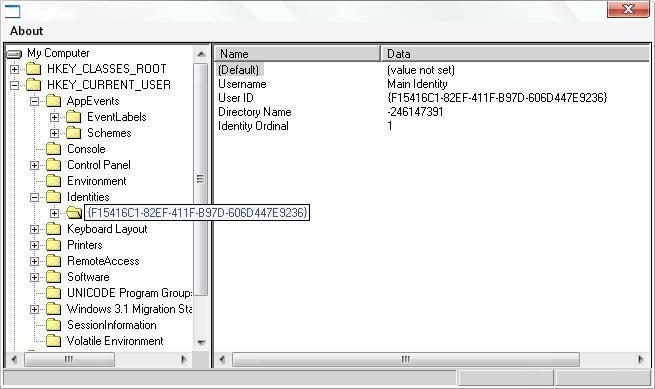



## Registry Tree View

### Description

Application that load keys data from registry and put it into Tree View, something like in system registry editor. Values manipulation is not available, but it's easy to add... (Made it five years ago, and now decided to upload and share it.)
 
### More Info
 

             |
---                |---
**Submitted On**   |2010-12-22 09:40:02
**By**             |[Edin Topalovic](https://github.com/Planet-Source-Code/PSCIndex/blob/master/ByAuthor/edin-topalovic.md)
**Level**          |Advanced
**User Rating**    |5.0 (10 globes from 2 users)
**Compatibility**  |VB 6\.0
**Category**       |[Registry](https://github.com/Planet-Source-Code/PSCIndex/blob/master/ByCategory/registry__1-36.md)
**World**          |[Visual Basic](https://github.com/Planet-Source-Code/PSCIndex/blob/master/ByWorld/visual-basic.md)
**Archive File**   |[Registry\_T21949712222010\.zip](https://github.com/Planet-Source-Code/edin-topalovic-registry-tree-view__1-73646/archive/master.zip)

